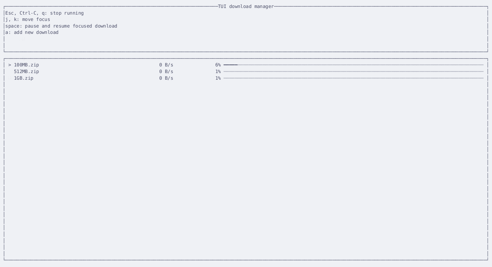

# TUI download manager

Educational project of a TUI application.

Displays a list of current downloads with their speed and progress. Each
download can be paused and resumed.

Key takeaways:

- [ratatui](https://github.com/ratatui-org/ratatui) and immediate rendering
- concurrency with only channels, no shared memory

Some things are not implemented like error handling and persistent download
state.

## Demo



## Usage

To start the app with example downloads:

```sh
cp .env.example .env
cargo run
```
